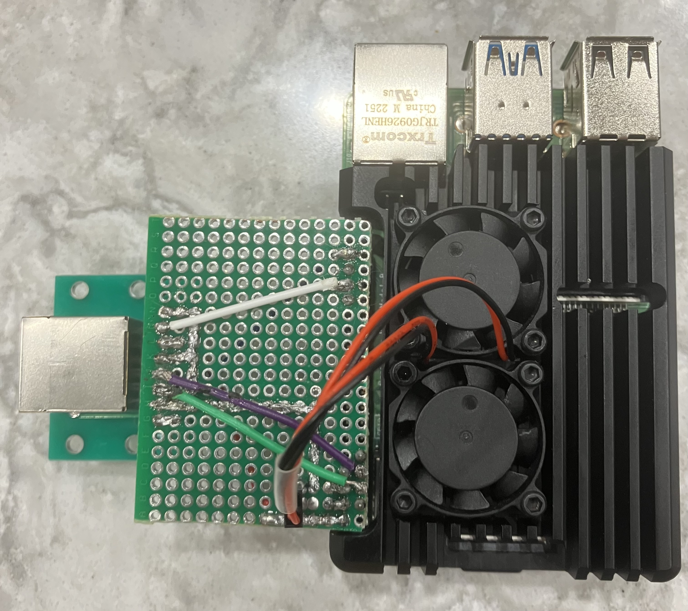
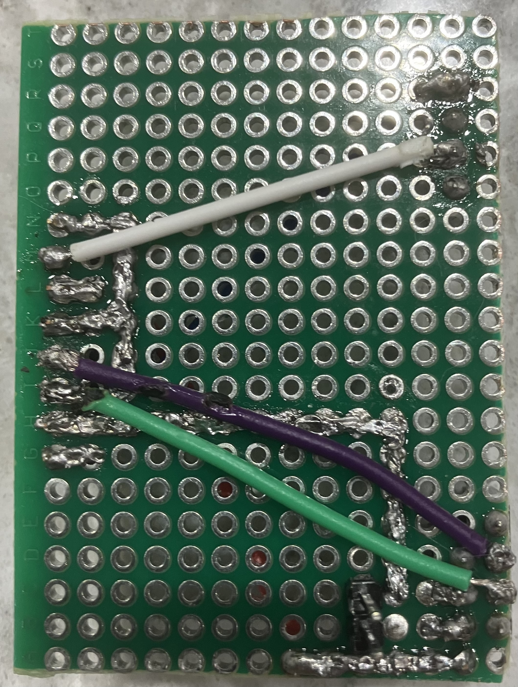
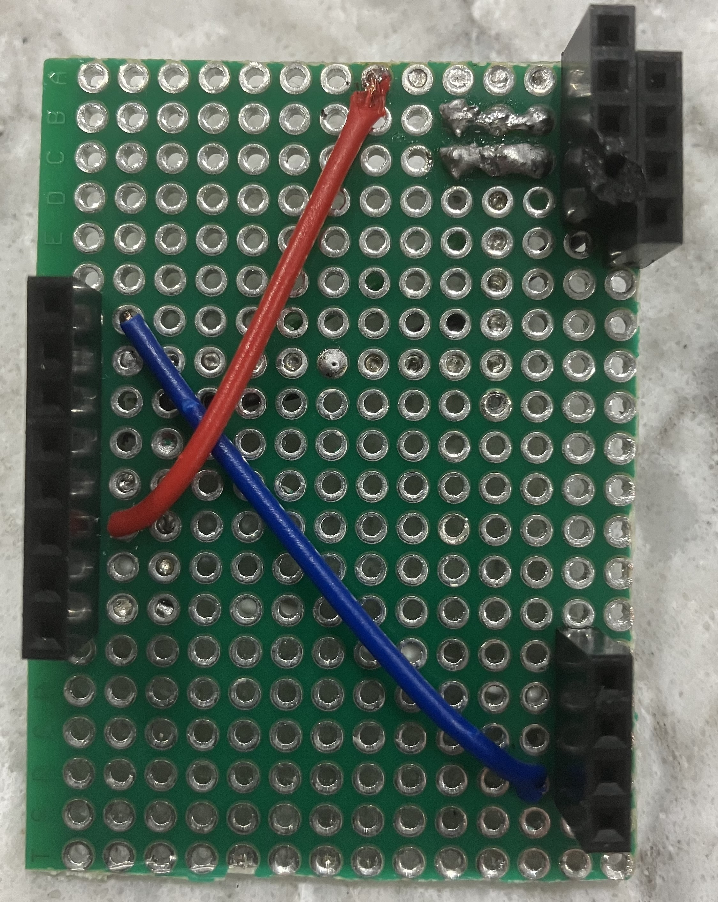
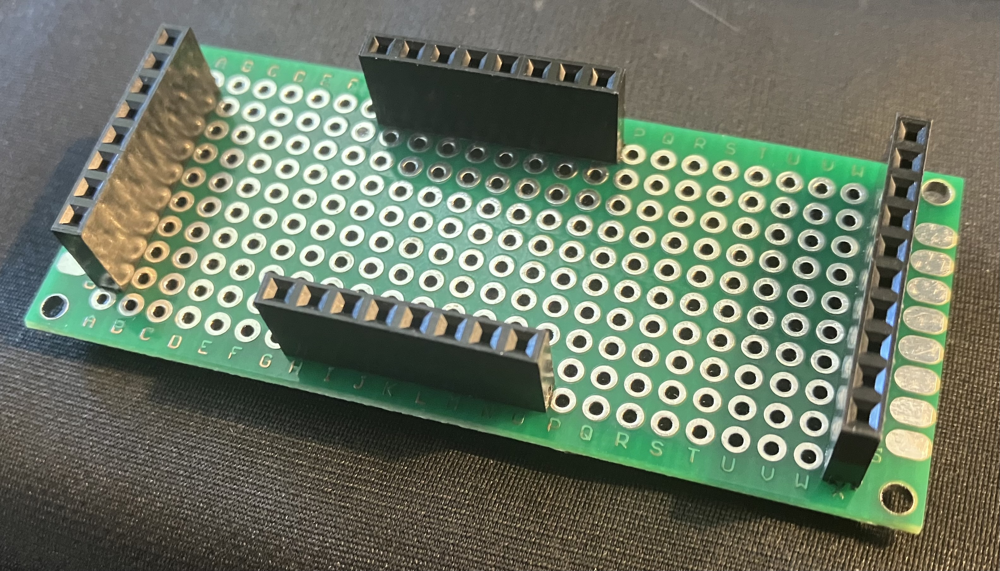
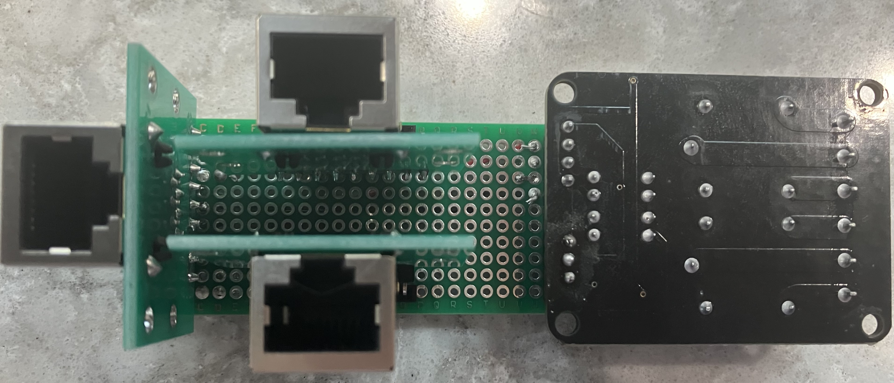
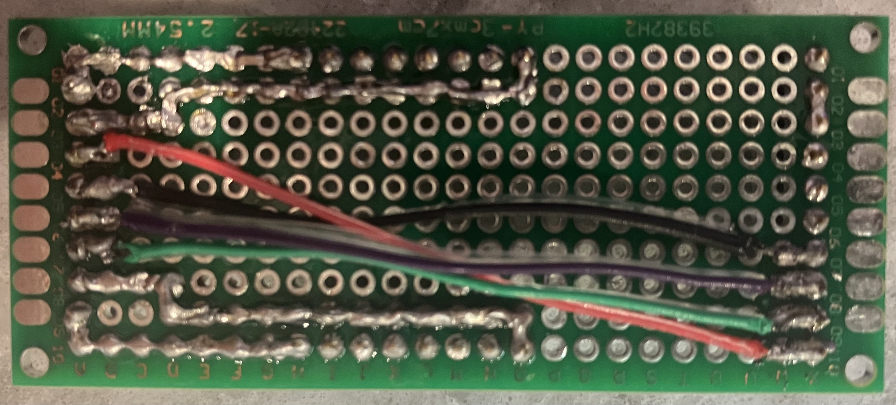

# Garage System

The codebase in the repo is one piece of the larger system, which includes
sensors, a relay, wiring, computing hardware, an OS, and various auxiliary
files.

## Hardware Components

The main hardware I used for the system includes:

- [Raspberry Pi 4B w/ 2GB RAM](https://www.amazon.com/dp/B09TTNPB4J)
- [RPi 4B Case w/ Fans](https://www.amazon.com/dp/B07VQLBSNC)
- [2 Channel DC 5V Relay Module](https://www.amazon.com/dp/B00E0NTPP4)[^1]
- 2x [Heavy Duty Reed Switch](https://www.amazon.com/dp/B07ZBT28L8)

[^1]: A single channel relay would be just fine, but maybe some day I will
  control the garage door lights as well.

I wanted wiring things from one part of the garage to another to be
convenient, so all of my long runs are cat6 (a.k.a. Ethernet) cables with
standard RJ45 plugs. To support that I needed a few more components:

- [RJ45 Screw Terminal Breakouts (2-pack)](https://www.amazon.com/dp/B0CJHQNHF2)
- [RJ45 Pin Breakouts (5-pack)](https://www.amazon.com/dp/B0B2P9C3DK)[^2]

[^2]: I actually desoldered the angled header pins from one of these and
  soldered on straight header pins, which isn't immediately obvious in the
  images but will make trying to work from them frustrating without knowing
  about that.

To put it all together I used a few more components and a lot of solder:

- [Double Sided PCB Boards](https://www.amazon.com/dp/B072Z7Y19F)
- [Female Pin Header Sockets](https://www.amazon.com/dp/B076GZXW3Z)
- [Male Pin Headers plus Jumper Wires](https://www.amazon.com/dp/B08X6C7PZM)

## Assemblies

There are four major assemblies connected to one another by cat6 runs:

- 2x Reed switch assemblies
- "Hat" assembly
- Splitter assembly

The reed switch assemblies are just the reed switches with their wire ends
screwed into the outer pair of terminals for the two RJ45 screw terminal
breakouts, but the other two are more complex.

### Wiring and Connectivity

Various [Raspberry Pi header
pins](https://www.raspberrypi.com/documentation/computers/raspberry-pi.html#gpio)
need to be connected to the various components. Each reed switch needs to
be connected to a GPIO pin (GPIO 12 for detecting when the door is closed,
GPIO 16 for detecting when the door is open) and ground. The relay needs to
be connected to a GPIO pin (GPIO 4) to control activating the garage door
opener (plus GPIO 3 for the other channel if I ever get around to
controlling the lights), plus 5V power and ground. To keep track of the
required connections, here's how things are connected from the Raspberry Pi
header pins to the reed switches and relay over the cat6 run from the hat
to the splitter:

| Color[^3] | Header Pin | Purpose            | Component       | RJ45 Pin |
|-----------|------------|--------------------|-----------------|----------|
| Black     | ground     |                    | reed switch 1   | 1        |
| White     | GPIO 12    | door closed sensor | reed switch 1   | 2        |
| Red       | 5V power   |                    | relay           | 3        |
| Black     | ground     |                    | relay           | 4        |
| Purple    | GPIO 4     | activate motor     | relay           | 5        |
| Green     | GPIO 3     | lights someday     | relay           | 6        |
| Black     | ground     |                    | reed switch 2   | 7        |
| Blue      | GPIO 16    | door open sensor   | reed switch 2   | 8        |

[^3]: The colors are arbitrary, but any colored wires in images are the
  correct color for what they are carrying)

### Hat Assembly

This has header pin sockets that connect to the Raspberry Pi GPIO pins, so
it's kind of like any other rpi or Arduino "hat". This is a view of the
assembly as installed on the Raspberry Pi:

You can see the RJ45 pin breakout installed on the left side of the image
in a socket on the assembly, and the 5V power and ground connected to the
case fans. A closer view without anything connected to it shows the
electrical connections and two header pins on one side of the assembly:

...and the sockets and more electrical connections on the other side:

### Splitter Assembly

The splitter has four header pin sockets:

With all components in place you can see:

- Left is for an RJ45 pin breakout to connect to the hat.
- Top and bottom are for RJ45 pin breakouts to connect the reed switches.
- Right is for the relay.

The connections (pardon my poor soldering) can be seen from the bottom:

## Deployment

I'm running [Debian](https://wiki.debian.org/RaspberryPi) on the Raspberry
Pi. To set things up for the garage monitor and controller I needed to set
up a few things:

- created a `gpio` group
- created a `garagemon` system user in the `gpio` group
- `mkdir --mode=755 /var/run/garagemon`
- `chown garagemon:root /var/run/garagemon`
- `chown root:gpio /dev/gpiochip*`
- `chmod 660 /dev/gpiochip*`

With all that in place, I could put the `garage-control` and
`garage-monitor` executables in `/usr/local/bin` and have them run via
systemd:

- [garage-control.service](../systemd/garage-control.service)
- [garage-monitor.service](../systemd/garage-monitor.service)

Giving the system a rudimentary UI requires an HTML page and proxying to
the `garage-control` service:

- [Web page](../web/index.html)
- [Apache config](../web/garage-ssl.conf)

